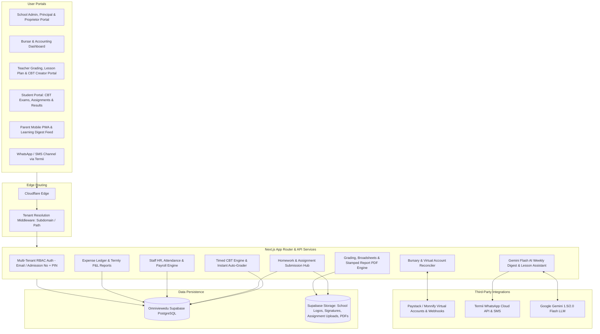

# Omniviewedu: Multi-Tenant Nigerian School Management System
## Production Blueprint & Database Schema (Enterprise Edition + Student CBT & Portal)

**Project Details:**
* **Application Name:** Omniviewedu
* **Database Provider:** Supabase PostgreSQL
* **Supabase Project ID:** `idiqejvfvwcjsgrvuear`
* **Region:** `eu-west-1` (West EU - Ireland)

---

## 1. System Architecture & Portals



---

## 2. Complete PostgreSQL Database Schema (15 Core Modules)

```sql
-- ============================================================================
-- 1. TENANTS & CONFIGURATION
-- ============================================================================

CREATE TABLE tenants (
    id UUID PRIMARY KEY DEFAULT gen_random_uuid(),
    name VARCHAR(255) NOT NULL,
    slug VARCHAR(100) UNIQUE NOT NULL, -- e.g. "greenfield-academy"
    custom_domain VARCHAR(255) UNIQUE,
    logo_url TEXT,
    stamp_url TEXT,
    signature_url TEXT,
    primary_color VARCHAR(10) DEFAULT '#1E40AF',
    email VARCHAR(255) NOT NULL,
    phone_number VARCHAR(50) NOT NULL,
    address TEXT,
    motto TEXT,
    subscription_plan VARCHAR(50) DEFAULT 'STANDARD',
    is_active BOOLEAN DEFAULT TRUE,
    created_at TIMESTAMP WITH TIME ZONE DEFAULT CURRENT_TIMESTAMP,
    updated_at TIMESTAMP WITH TIME ZONE DEFAULT CURRENT_TIMESTAMP
);

-- ============================================================================
-- 2. USERS & ROLES (RBAC) - Supports Email, Phone or Admission Number Login
-- ============================================================================

CREATE TYPE user_role AS ENUM (
    'SUPER_ADMIN', 
    'PROPRIETOR',
    'SCHOOL_ADMIN', 
    'PRINCIPAL', 
    'BURSAR', 
    'HR_MANAGER',
    'TEACHER', 
    'NON_TEACHING_STAFF',
    'PARENT', 
    'STUDENT'
);

CREATE TABLE users (
    id UUID PRIMARY KEY DEFAULT gen_random_uuid(),
    tenant_id UUID REFERENCES tenants(id) ON DELETE CASCADE,
    email VARCHAR(255),
    phone_number VARCHAR(50),
    username VARCHAR(100), -- Used for Student Admission Number login
    password_hash TEXT NOT NULL,
    role user_role NOT NULL,
    first_name VARCHAR(100) NOT NULL,
    last_name VARCHAR(100) NOT NULL,
    avatar_url TEXT,
    is_active BOOLEAN DEFAULT TRUE,
    created_at TIMESTAMP WITH TIME ZONE DEFAULT CURRENT_TIMESTAMP,
    updated_at TIMESTAMP WITH TIME ZONE DEFAULT CURRENT_TIMESTAMP,
    CONSTRAINT unique_tenant_email UNIQUE (tenant_id, email),
    CONSTRAINT unique_tenant_phone UNIQUE (tenant_id, phone_number),
    CONSTRAINT unique_tenant_username UNIQUE (tenant_id, username)
);

-- ============================================================================
-- 3. STAFF, HR & DEPARTMENTS
-- ============================================================================

CREATE TYPE department_type AS ENUM ('ACADEMIC', 'ADMINISTRATIVE', 'MAINTENANCE', 'SECURITY', 'TRANSPORT');

CREATE TABLE staff_departments (
    id UUID PRIMARY KEY DEFAULT gen_random_uuid(),
    tenant_id UUID NOT NULL REFERENCES tenants(id) ON DELETE CASCADE,
    name VARCHAR(100) NOT NULL,
    dept_type department_type NOT NULL DEFAULT 'ACADEMIC',
    created_at TIMESTAMP WITH TIME ZONE DEFAULT CURRENT_TIMESTAMP
);

CREATE TYPE staff_category AS ENUM ('TEACHING', 'NON_TEACHING');
CREATE TYPE employment_type AS ENUM ('FULL_TIME', 'PART_TIME', 'CONTRACT');

CREATE TABLE staff_profiles (
    id UUID PRIMARY KEY DEFAULT gen_random_uuid(),
    tenant_id UUID NOT NULL REFERENCES tenants(id) ON DELETE CASCADE,
    user_id UUID UNIQUE NOT NULL REFERENCES users(id) ON DELETE CASCADE,
    staff_id_number VARCHAR(50) NOT NULL,
    department_id UUID REFERENCES staff_departments(id) ON DELETE SET NULL,
    category staff_category NOT NULL DEFAULT 'TEACHING',
    employment_type employment_type DEFAULT 'FULL_TIME',
    designation VARCHAR(100) NOT NULL,
    qualification VARCHAR(100),
    date_of_joining DATE DEFAULT CURRENT_DATE,
    base_salary NUMERIC(12, 2) DEFAULT 0.00,
    bank_name VARCHAR(100),
    bank_account_number VARCHAR(20),
    bank_account_name VARCHAR(150),
    emergency_contact_name VARCHAR(100),
    emergency_contact_phone VARCHAR(50),
    is_active BOOLEAN DEFAULT TRUE,
    created_at TIMESTAMP WITH TIME ZONE DEFAULT CURRENT_TIMESTAMP,
    CONSTRAINT unique_tenant_staff_id UNIQUE (tenant_id, staff_id_number)
);

CREATE TYPE staff_attendance_status AS ENUM ('PRESENT', 'ABSENT', 'LATE', 'HALF_DAY', 'ON_LEAVE');

CREATE TABLE staff_attendance (
    id UUID PRIMARY KEY DEFAULT gen_random_uuid(),
    tenant_id UUID NOT NULL REFERENCES tenants(id) ON DELETE CASCADE,
    staff_id UUID NOT NULL REFERENCES staff_profiles(id) ON DELETE CASCADE,
    attendance_date DATE NOT NULL DEFAULT CURRENT_DATE,
    status staff_attendance_status NOT NULL DEFAULT 'PRESENT',
    clock_in_time TIME,
    clock_out_time TIME,
    notes TEXT,
    created_at TIMESTAMP WITH TIME ZONE DEFAULT CURRENT_TIMESTAMP,
    CONSTRAINT unique_staff_daily_attendance UNIQUE (staff_id, attendance_date)
);

CREATE TYPE leave_status AS ENUM ('PENDING', 'APPROVED', 'REJECTED', 'CANCELLED');

CREATE TABLE staff_leave_requests (
    id UUID PRIMARY KEY DEFAULT gen_random_uuid(),
    tenant_id UUID NOT NULL REFERENCES tenants(id) ON DELETE CASCADE,
    staff_id UUID NOT NULL REFERENCES staff_profiles(id) ON DELETE CASCADE,
    leave_type VARCHAR(50) NOT NULL,
    start_date DATE NOT NULL,
    end_date DATE NOT NULL,
    reason TEXT NOT NULL,
    status leave_status DEFAULT 'PENDING',
    approved_by UUID REFERENCES users(id) ON DELETE SET NULL,
    approval_notes TEXT,
    created_at TIMESTAMP WITH TIME ZONE DEFAULT CURRENT_TIMESTAMP
);

-- ============================================================================
-- 4. STAFF PAYROLL & PAYSLIPS
-- ============================================================================

CREATE TYPE payroll_status AS ENUM ('DRAFT', 'PENDING_APPROVAL', 'APPROVED', 'PAID');

CREATE TABLE payroll_runs (
    id UUID PRIMARY KEY DEFAULT gen_random_uuid(),
    tenant_id UUID NOT NULL REFERENCES tenants(id) ON DELETE CASCADE,
    month INT NOT NULL CHECK (month BETWEEN 1 AND 12),
    year INT NOT NULL,
    total_gross_amount NUMERIC(12, 2) DEFAULT 0.00,
    total_deductions_amount NUMERIC(12, 2) DEFAULT 0.00,
    total_net_amount NUMERIC(12, 2) DEFAULT 0.00,
    status payroll_status DEFAULT 'DRAFT',
    approved_by UUID REFERENCES users(id) ON DELETE SET NULL,
    paid_at TIMESTAMP WITH TIME ZONE,
    created_at TIMESTAMP WITH TIME ZONE DEFAULT CURRENT_TIMESTAMP,
    CONSTRAINT unique_tenant_month_payroll UNIQUE (tenant_id, month, year)
);

CREATE TABLE staff_payslips (
    id UUID PRIMARY KEY DEFAULT gen_random_uuid(),
    tenant_id UUID NOT NULL REFERENCES tenants(id) ON DELETE CASCADE,
    payroll_run_id UUID NOT NULL REFERENCES payroll_runs(id) ON DELETE CASCADE,
    staff_id UUID NOT NULL REFERENCES staff_profiles(id) ON DELETE CASCADE,
    base_salary NUMERIC(12, 2) NOT NULL,
    allowances_jsonb JSONB DEFAULT '{}'::jsonb,
    deductions_jsonb JSONB DEFAULT '{}'::jsonb,
    gross_salary NUMERIC(12, 2) NOT NULL,
    total_deductions NUMERIC(12, 2) NOT NULL,
    net_salary NUMERIC(12, 2) NOT NULL,
    is_paid BOOLEAN DEFAULT FALSE,
    payment_method VARCHAR(50) DEFAULT 'BANK_TRANSFER',
    payment_reference VARCHAR(100),
    created_at TIMESTAMP WITH TIME ZONE DEFAULT CURRENT_TIMESTAMP,
    CONSTRAINT unique_staff_payroll_run UNIQUE (payroll_run_id, staff_id)
);

-- ============================================================================
-- 5. ACADEMIC SESSIONS, TERMS & CLASSES
-- ============================================================================

CREATE TABLE academic_sessions (
    id UUID PRIMARY KEY DEFAULT gen_random_uuid(),
    tenant_id UUID NOT NULL REFERENCES tenants(id) ON DELETE CASCADE,
    name VARCHAR(50) NOT NULL, -- e.g. "2025/2026"
    start_date DATE NOT NULL,
    end_date DATE NOT NULL,
    is_current BOOLEAN DEFAULT FALSE,
    created_at TIMESTAMP WITH TIME ZONE DEFAULT CURRENT_TIMESTAMP
);

CREATE TYPE term_name AS ENUM ('FIRST_TERM', 'SECOND_TERM', 'THIRD_TERM');

CREATE TABLE academic_terms (
    id UUID PRIMARY KEY DEFAULT gen_random_uuid(),
    tenant_id UUID NOT NULL REFERENCES tenants(id) ON DELETE CASCADE,
    session_id UUID NOT NULL REFERENCES academic_sessions(id) ON DELETE CASCADE,
    name term_name NOT NULL,
    start_date DATE NOT NULL,
    end_date DATE NOT NULL,
    next_term_resumption_date DATE,
    is_current BOOLEAN DEFAULT FALSE,
    created_at TIMESTAMP WITH TIME ZONE DEFAULT CURRENT_TIMESTAMP
);

CREATE TYPE school_section AS ENUM ('CRECHE', 'NURSERY', 'PRIMARY', 'JUNIOR_SECONDARY', 'SENIOR_SECONDARY');

CREATE TABLE class_levels (
    id UUID PRIMARY KEY DEFAULT gen_random_uuid(),
    tenant_id UUID NOT NULL REFERENCES tenants(id) ON DELETE CASCADE,
    name VARCHAR(100) NOT NULL,
    section school_section NOT NULL,
    order_index INT NOT NULL,
    created_at TIMESTAMP WITH TIME ZONE DEFAULT CURRENT_TIMESTAMP
);

CREATE TABLE class_arms (
    id UUID PRIMARY KEY DEFAULT gen_random_uuid(),
    tenant_id UUID NOT NULL REFERENCES tenants(id) ON DELETE CASCADE,
    class_level_id UUID NOT NULL REFERENCES class_levels(id) ON DELETE CASCADE,
    name VARCHAR(50) NOT NULL,
    class_teacher_id UUID REFERENCES staff_profiles(id) ON DELETE SET NULL,
    created_at TIMESTAMP WITH TIME ZONE DEFAULT CURRENT_TIMESTAMP
);

-- ============================================================================
-- 6. STUDENTS & GUARDIANS
-- ============================================================================

CREATE TABLE students (
    id UUID PRIMARY KEY DEFAULT gen_random_uuid(),
    tenant_id UUID NOT NULL REFERENCES tenants(id) ON DELETE CASCADE,
    user_id UUID UNIQUE REFERENCES users(id) ON DELETE SET NULL, -- Links to Student Login Account
    admission_number VARCHAR(100) NOT NULL,
    first_name VARCHAR(100) NOT NULL,
    last_name VARCHAR(100) NOT NULL,
    middle_name VARCHAR(100),
    gender VARCHAR(10) CHECK (gender IN ('MALE', 'FEMALE')),
    date_of_birth DATE,
    current_class_arm_id UUID REFERENCES class_arms(id) ON DELETE SET NULL,
    photo_url TEXT,
    state_of_origin VARCHAR(100),
    residential_address TEXT,
    enrollment_date DATE DEFAULT CURRENT_DATE,
    is_active BOOLEAN DEFAULT TRUE,
    created_at TIMESTAMP WITH TIME ZONE DEFAULT CURRENT_TIMESTAMP,
    CONSTRAINT unique_tenant_admission_number UNIQUE (tenant_id, admission_number)
);

CREATE TABLE guardians (
    id UUID PRIMARY KEY DEFAULT gen_random_uuid(),
    tenant_id UUID NOT NULL REFERENCES tenants(id) ON DELETE CASCADE,
    user_id UUID NOT NULL REFERENCES users(id) ON DELETE CASCADE,
    relationship_type VARCHAR(50) DEFAULT 'PARENT',
    occupation VARCHAR(100),
    home_address TEXT,
    alt_phone_number VARCHAR(50),
    created_at TIMESTAMP WITH TIME ZONE DEFAULT CURRENT_TIMESTAMP
);

CREATE TABLE student_guardians (
    student_id UUID NOT NULL REFERENCES students(id) ON DELETE CASCADE,
    guardian_id UUID NOT NULL REFERENCES guardians(id) ON DELETE CASCADE,
    is_primary_contact BOOLEAN DEFAULT TRUE,
    PRIMARY KEY (student_id, guardian_id)
);

-- ============================================================================
-- 7. SUBJECTS & ALLOCATIONS
-- ============================================================================

CREATE TABLE subjects (
    id UUID PRIMARY KEY DEFAULT gen_random_uuid(),
    tenant_id UUID NOT NULL REFERENCES tenants(id) ON DELETE CASCADE,
    name VARCHAR(150) NOT NULL,
    code VARCHAR(50),
    section school_section NOT NULL,
    created_at TIMESTAMP WITH TIME ZONE DEFAULT CURRENT_TIMESTAMP
);

CREATE TABLE class_subjects (
    id UUID PRIMARY KEY DEFAULT gen_random_uuid(),
    tenant_id UUID NOT NULL REFERENCES tenants(id) ON DELETE CASCADE,
    class_arm_id UUID NOT NULL REFERENCES class_arms(id) ON DELETE CASCADE,
    subject_id UUID NOT NULL REFERENCES subjects(id) ON DELETE CASCADE,
    teacher_id UUID REFERENCES staff_profiles(id) ON DELETE SET NULL,
    created_at TIMESTAMP WITH TIME ZONE DEFAULT CURRENT_TIMESTAMP,
    CONSTRAINT unique_class_subject UNIQUE (class_arm_id, subject_id)
);

-- ============================================================================
-- 8. STUDENT ASSIGNMENTS & HOMEWORK ENGINE
-- ============================================================================

CREATE TABLE assignments (
    id UUID PRIMARY KEY DEFAULT gen_random_uuid(),
    tenant_id UUID NOT NULL REFERENCES tenants(id) ON DELETE CASCADE,
    class_subject_id UUID NOT NULL REFERENCES class_subjects(id) ON DELETE CASCADE,
    term_id UUID NOT NULL REFERENCES academic_terms(id) ON DELETE CASCADE,
    title VARCHAR(255) NOT NULL,
    description TEXT NOT NULL,
    attachment_url TEXT, -- PDF/Image uploaded by teacher
    due_date TIMESTAMP WITH TIME ZONE NOT NULL,
    max_score NUMERIC(5, 2) DEFAULT 10.00,
    created_by UUID REFERENCES users(id) ON DELETE SET NULL,
    created_at TIMESTAMP WITH TIME ZONE DEFAULT CURRENT_TIMESTAMP
);

CREATE TYPE submission_status AS ENUM ('SUBMITTED', 'GRADED', 'LATE', 'RESUBMITTED');

CREATE TABLE assignment_submissions (
    id UUID PRIMARY KEY DEFAULT gen_random_uuid(),
    tenant_id UUID NOT NULL REFERENCES tenants(id) ON DELETE CASCADE,
    assignment_id UUID NOT NULL REFERENCES assignments(id) ON DELETE CASCADE,
    student_id UUID NOT NULL REFERENCES students(id) ON DELETE CASCADE,
    submission_text TEXT,
    attachment_url TEXT, -- Student photo/PDF upload of homework
    score NUMERIC(5, 2),
    teacher_feedback TEXT,
    status submission_status DEFAULT 'SUBMITTED',
    submitted_at TIMESTAMP WITH TIME ZONE DEFAULT CURRENT_TIMESTAMP,
    graded_at TIMESTAMP WITH TIME ZONE,
    CONSTRAINT unique_student_assignment UNIQUE (assignment_id, student_id)
);

-- ============================================================================
-- 9. COMPUTER-BASED TESTING (CBT) & EXAMINATIONS ENGINE
-- ============================================================================

CREATE TYPE cbt_status AS ENUM ('DRAFT', 'PUBLISHED', 'CLOSED', 'ARCHIVED');

CREATE TABLE cbt_exams (
    id UUID PRIMARY KEY DEFAULT gen_random_uuid(),
    tenant_id UUID NOT NULL REFERENCES tenants(id) ON DELETE CASCADE,
    class_subject_id UUID NOT NULL REFERENCES class_subjects(id) ON DELETE CASCADE,
    term_id UUID NOT NULL REFERENCES academic_terms(id) ON DELETE CASCADE,
    title VARCHAR(255) NOT NULL, -- e.g. "JSS 2 1st Term Mid-Term Mathematics CBT"
    instructions TEXT,
    duration_minutes INT NOT NULL DEFAULT 30, -- Countdown timer
    total_marks NUMERIC(5, 2) NOT NULL DEFAULT 20.00,
    pass_percentage NUMERIC(5, 2) DEFAULT 50.00,
    shuffle_questions BOOLEAN DEFAULT TRUE,
    show_instant_result BOOLEAN DEFAULT TRUE,
    start_time TIMESTAMP WITH TIME ZONE,
    end_time TIMESTAMP WITH TIME ZONE,
    status cbt_status DEFAULT 'DRAFT',
    created_by UUID REFERENCES users(id) ON DELETE SET NULL,
    created_at TIMESTAMP WITH TIME ZONE DEFAULT CURRENT_TIMESTAMP
);

CREATE TYPE question_type AS ENUM ('MULTIPLE_CHOICE', 'TRUE_FALSE');

CREATE TABLE cbt_questions (
    id UUID PRIMARY KEY DEFAULT gen_random_uuid(),
    tenant_id UUID NOT NULL REFERENCES tenants(id) ON DELETE CASCADE,
    cbt_exam_id UUID NOT NULL REFERENCES cbt_exams(id) ON DELETE CASCADE,
    question_text TEXT NOT NULL,
    question_image_url TEXT,
    q_type question_type DEFAULT 'MULTIPLE_CHOICE',
    -- Options Array: [{"key": "A", "text": "..."}, {"key": "B", "text": "..."}]
    options_jsonb JSONB NOT NULL,
    correct_answer VARCHAR(10) NOT NULL, -- e.g. "A" or "TRUE"
    explanation TEXT,
    marks NUMERIC(4, 2) DEFAULT 1.00,
    order_index INT NOT NULL DEFAULT 1,
    created_at TIMESTAMP WITH TIME ZONE DEFAULT CURRENT_TIMESTAMP
);

CREATE TYPE attempt_status AS ENUM ('IN_PROGRESS', 'SUBMITTED', 'TIMED_OUT');

CREATE TABLE cbt_student_attempts (
    id UUID PRIMARY KEY DEFAULT gen_random_uuid(),
    tenant_id UUID NOT NULL REFERENCES tenants(id) ON DELETE CASCADE,
    cbt_exam_id UUID NOT NULL REFERENCES cbt_exams(id) ON DELETE CASCADE,
    student_id UUID NOT NULL REFERENCES students(id) ON DELETE CASCADE,
    start_time TIMESTAMP WITH TIME ZONE DEFAULT CURRENT_TIMESTAMP,
    end_time TIMESTAMP WITH TIME ZONE,
    -- Student Answers: [{"question_id": "...", "selected_answer": "C", "is_correct": true}]
    answers_jsonb JSONB DEFAULT '[]'::jsonb,
    score_obtained NUMERIC(5, 2) DEFAULT 0.00,
    percentage_score NUMERIC(5, 2) DEFAULT 0.00,
    status attempt_status DEFAULT 'IN_PROGRESS',
    submitted_at TIMESTAMP WITH TIME ZONE,
    CONSTRAINT unique_student_cbt_attempt UNIQUE (cbt_exam_id, student_id)
);

-- ============================================================================
-- 10. BURSARY, INVOICING & VIRTUAL BANK ACCOUNTS
-- ============================================================================

CREATE TABLE fee_categories (
    id UUID PRIMARY KEY DEFAULT gen_random_uuid(),
    tenant_id UUID NOT NULL REFERENCES tenants(id) ON DELETE CASCADE,
    name VARCHAR(100) NOT NULL,
    description TEXT,
    created_at TIMESTAMP WITH TIME ZONE DEFAULT CURRENT_TIMESTAMP
);

CREATE TABLE fee_structures (
    id UUID PRIMARY KEY DEFAULT gen_random_uuid(),
    tenant_id UUID NOT NULL REFERENCES tenants(id) ON DELETE CASCADE,
    term_id UUID NOT NULL REFERENCES academic_terms(id) ON DELETE CASCADE,
    class_level_id UUID NOT NULL REFERENCES class_levels(id) ON DELETE CASCADE,
    fee_category_id UUID NOT NULL REFERENCES fee_categories(id) ON DELETE CASCADE,
    amount NUMERIC(12, 2) NOT NULL,
    is_compulsory BOOLEAN DEFAULT TRUE,
    created_at TIMESTAMP WITH TIME ZONE DEFAULT CURRENT_TIMESTAMP
);

CREATE TYPE invoice_status AS ENUM ('UNPAID', 'PARTIALLY_PAID', 'PAID', 'VOID');

CREATE TABLE invoices (
    id UUID PRIMARY KEY DEFAULT gen_random_uuid(),
    tenant_id UUID NOT NULL REFERENCES tenants(id) ON DELETE CASCADE,
    student_id UUID NOT NULL REFERENCES students(id) ON DELETE CASCADE,
    term_id UUID NOT NULL REFERENCES academic_terms(id) ON DELETE CASCADE,
    invoice_number VARCHAR(100) NOT NULL,
    total_amount NUMERIC(12, 2) NOT NULL,
    paid_amount NUMERIC(12, 2) DEFAULT 0.00,
    status invoice_status DEFAULT 'UNPAID',
    due_date DATE,
    created_at TIMESTAMP WITH TIME ZONE DEFAULT CURRENT_TIMESTAMP,
    CONSTRAINT unique_tenant_invoice_number UNIQUE (tenant_id, invoice_number)
);

CREATE TABLE invoice_items (
    id UUID PRIMARY KEY DEFAULT gen_random_uuid(),
    invoice_id UUID NOT NULL REFERENCES invoices(id) ON DELETE CASCADE,
    fee_category_id UUID NOT NULL REFERENCES fee_categories(id) ON DELETE RESTRICT,
    amount NUMERIC(12, 2) NOT NULL
);

CREATE TABLE student_virtual_accounts (
    id UUID PRIMARY KEY DEFAULT gen_random_uuid(),
    tenant_id UUID NOT NULL REFERENCES tenants(id) ON DELETE CASCADE,
    student_id UUID NOT NULL REFERENCES students(id) ON DELETE CASCADE,
    provider VARCHAR(50) NOT NULL,
    account_number VARCHAR(20) NOT NULL,
    bank_name VARCHAR(100) NOT NULL,
    account_name VARCHAR(255) NOT NULL,
    reference_id VARCHAR(150) UNIQUE NOT NULL,
    created_at TIMESTAMP WITH TIME ZONE DEFAULT CURRENT_TIMESTAMP,
    CONSTRAINT unique_student_provider UNIQUE (student_id, provider)
);

CREATE TYPE payment_channel AS ENUM ('VIRTUAL_ACCOUNT_TRANSFER', 'CARD', 'USSD', 'DIRECT_CASH', 'POS');

CREATE TABLE payments (
    id UUID PRIMARY KEY DEFAULT gen_random_uuid(),
    tenant_id UUID NOT NULL REFERENCES tenants(id) ON DELETE CASCADE,
    invoice_id UUID NOT NULL REFERENCES invoices(id) ON DELETE RESTRICT,
    amount NUMERIC(12, 2) NOT NULL,
    channel payment_channel NOT NULL,
    transaction_reference VARCHAR(150) UNIQUE NOT NULL,
    receipt_number VARCHAR(100) UNIQUE NOT NULL,
    paid_at TIMESTAMP WITH TIME ZONE DEFAULT CURRENT_TIMESTAMP,
    notes TEXT
);

-- ============================================================================
-- 11. EXPENSE MANAGEMENT, VENDORS & SCHOOL ACCOUNTING
-- ============================================================================

CREATE TABLE expense_categories (
    id UUID PRIMARY KEY DEFAULT gen_random_uuid(),
    tenant_id UUID NOT NULL REFERENCES tenants(id) ON DELETE CASCADE,
    name VARCHAR(150) NOT NULL,
    description TEXT,
    created_at TIMESTAMP WITH TIME ZONE DEFAULT CURRENT_TIMESTAMP
);

CREATE TABLE vendors (
    id UUID PRIMARY KEY DEFAULT gen_random_uuid(),
    tenant_id UUID NOT NULL REFERENCES tenants(id) ON DELETE CASCADE,
    name VARCHAR(200) NOT NULL,
    contact_person VARCHAR(100),
    phone_number VARCHAR(50),
    email VARCHAR(255),
    service_type VARCHAR(100),
    bank_name VARCHAR(100),
    bank_account_number VARCHAR(20),
    address TEXT,
    created_at TIMESTAMP WITH TIME ZONE DEFAULT CURRENT_TIMESTAMP
);

CREATE TYPE expense_status AS ENUM ('PENDING_APPROVAL', 'APPROVED', 'REJECTED', 'PAID');

CREATE TABLE school_expenses (
    id UUID PRIMARY KEY DEFAULT gen_random_uuid(),
    tenant_id UUID NOT NULL REFERENCES tenants(id) ON DELETE CASCADE,
    term_id UUID REFERENCES academic_terms(id) ON DELETE SET NULL,
    category_id UUID NOT NULL REFERENCES expense_categories(id) ON DELETE RESTRICT,
    vendor_id UUID REFERENCES vendors(id) ON DELETE SET NULL,
    title VARCHAR(255) NOT NULL,
    amount NUMERIC(12, 2) NOT NULL,
    expense_date DATE NOT NULL DEFAULT CURRENT_DATE,
    payment_method VARCHAR(50) DEFAULT 'BANK_TRANSFER',
    receipt_image_url TEXT,
    status expense_status DEFAULT 'APPROVED',
    recorded_by UUID NOT NULL REFERENCES users(id) ON DELETE RESTRICT,
    approved_by UUID REFERENCES users(id) ON DELETE SET NULL,
    notes TEXT,
    created_at TIMESTAMP WITH TIME ZONE DEFAULT CURRENT_TIMESTAMP
);

-- ============================================================================
-- 12. STORE & INVENTORY (Uniforms, Books & Badges)
-- ============================================================================

CREATE TYPE inventory_category AS ENUM ('UNIFORM', 'TEXTBOOK', 'EXERCISE_BOOK', 'BADGE', 'SPORT_WEAR', 'ASSET');

CREATE TABLE inventory_items (
    id UUID PRIMARY KEY DEFAULT gen_random_uuid(),
    tenant_id UUID NOT NULL REFERENCES tenants(id) ON DELETE CASCADE,
    name VARCHAR(200) NOT NULL,
    category inventory_category NOT NULL,
    cost_price NUMERIC(12, 2) DEFAULT 0.00,
    selling_price NUMERIC(12, 2) NOT NULL,
    quantity_in_stock INT NOT NULL DEFAULT 0,
    reorder_level INT DEFAULT 5,
    created_at TIMESTAMP WITH TIME ZONE DEFAULT CURRENT_TIMESTAMP
);

CREATE TYPE inventory_tx_type AS ENUM ('PURCHASE_STOCK', 'SALE_TO_STUDENT', 'DAMAGED_DISPOSAL', 'RETURN');

CREATE TABLE inventory_transactions (
    id UUID PRIMARY KEY DEFAULT gen_random_uuid(),
    tenant_id UUID NOT NULL REFERENCES tenants(id) ON DELETE CASCADE,
    item_id UUID NOT NULL REFERENCES inventory_items(id) ON DELETE CASCADE,
    transaction_type inventory_tx_type NOT NULL,
    quantity INT NOT NULL,
    unit_price NUMERIC(12, 2) NOT NULL,
    total_amount NUMERIC(12, 2) NOT NULL,
    student_id UUID REFERENCES students(id) ON DELETE SET NULL,
    performed_by UUID NOT NULL REFERENCES users(id) ON DELETE RESTRICT,
    notes TEXT,
    created_at TIMESTAMP WITH TIME ZONE DEFAULT CURRENT_TIMESTAMP
);

-- ============================================================================
-- 13. ACADEMIC ASSESSMENTS, SCORES & REPORT CARDS
-- ============================================================================

CREATE TABLE student_subject_scores (
    id UUID PRIMARY KEY DEFAULT gen_random_uuid(),
    tenant_id UUID NOT NULL REFERENCES tenants(id) ON DELETE CASCADE,
    term_id UUID NOT NULL REFERENCES academic_terms(id) ON DELETE CASCADE,
    class_subject_id UUID NOT NULL REFERENCES class_subjects(id) ON DELETE CASCADE,
    student_id UUID NOT NULL REFERENCES students(id) ON DELETE CASCADE,
    ca1_score NUMERIC(5, 2) DEFAULT 0.00,
    ca2_score NUMERIC(5, 2) DEFAULT 0.00,
    ca3_midterm_score NUMERIC(5, 2) DEFAULT 0.00,
    exam_score NUMERIC(5, 2) DEFAULT 0.00,
    total_score NUMERIC(5, 2) GENERATED ALWAYS AS (ca1_score + ca2_score + ca3_midterm_score + exam_score) STORED,
    grade VARCHAR(5),
    position_in_subject INT,
    teacher_remark TEXT,
    created_at TIMESTAMP WITH TIME ZONE DEFAULT CURRENT_TIMESTAMP,
    updated_at TIMESTAMP WITH TIME ZONE DEFAULT CURRENT_TIMESTAMP,
    CONSTRAINT unique_student_term_subject UNIQUE (term_id, class_subject_id, student_id)
);

CREATE TABLE student_term_reports (
    id UUID PRIMARY KEY DEFAULT gen_random_uuid(),
    tenant_id UUID NOT NULL REFERENCES tenants(id) ON DELETE CASCADE,
    term_id UUID NOT NULL REFERENCES academic_terms(id) ON DELETE CASCADE,
    student_id UUID NOT NULL REFERENCES students(id) ON DELETE CASCADE,
    class_arm_id UUID NOT NULL REFERENCES class_arms(id) ON DELETE CASCADE,
    total_score NUMERIC(7, 2),
    average_score NUMERIC(5, 2),
    class_position INT,
    class_size INT,
    affective_domain_jsonb JSONB DEFAULT '{}'::jsonb,
    psychomotor_domain_jsonb JSONB DEFAULT '{}'::jsonb,
    attendance_days_present INT DEFAULT 0,
    attendance_days_opened INT DEFAULT 0,
    teacher_remark TEXT,
    principal_remark TEXT,
    is_published BOOLEAN DEFAULT FALSE,
    created_at TIMESTAMP WITH TIME ZONE DEFAULT CURRENT_TIMESTAMP,
    CONSTRAINT unique_student_term_report UNIQUE (term_id, student_id)
);

-- ============================================================================
-- 14. LESSON NOTES & AI WEEKLY PARENT DIGEST ENGINE
-- ============================================================================

CREATE TYPE lesson_note_status AS ENUM ('DRAFT', 'SUBMITTED_FOR_REVIEW', 'APPROVED', 'REJECTED');

CREATE TABLE weekly_lesson_notes (
    id UUID PRIMARY KEY DEFAULT gen_random_uuid(),
    tenant_id UUID NOT NULL REFERENCES tenants(id) ON DELETE CASCADE,
    class_subject_id UUID NOT NULL REFERENCES class_subjects(id) ON DELETE CASCADE,
    term_id UUID NOT NULL REFERENCES academic_terms(id) ON DELETE CASCADE,
    week_number INT NOT NULL CHECK (week_number BETWEEN 1 AND 15),
    topic VARCHAR(255) NOT NULL,
    subtopics TEXT,
    learning_objectives TEXT,
    homework_assigned TEXT,
    status lesson_note_status DEFAULT 'DRAFT',
    created_at TIMESTAMP WITH TIME ZONE DEFAULT CURRENT_TIMESTAMP,
    updated_at TIMESTAMP WITH TIME ZONE DEFAULT CURRENT_TIMESTAMP
);

CREATE TYPE digest_status AS ENUM ('PENDING_GENERATION', 'GENERATED', 'SENT', 'FAILED');

CREATE TABLE ai_weekly_digests (
    id UUID PRIMARY KEY DEFAULT gen_random_uuid(),
    tenant_id UUID NOT NULL REFERENCES tenants(id) ON DELETE CASCADE,
    class_arm_id UUID NOT NULL REFERENCES class_arms(id) ON DELETE CASCADE,
    term_id UUID NOT NULL REFERENCES academic_terms(id) ON DELETE CASCADE,
    week_number INT NOT NULL,
    raw_topics_payload JSONB NOT NULL,
    digest_summary_markdown TEXT NOT NULL,
    discussion_questions_jsonb JSONB NOT NULL,
    weekend_practice_notes TEXT,
    status digest_status DEFAULT 'GENERATED',
    generated_at TIMESTAMP WITH TIME ZONE DEFAULT CURRENT_TIMESTAMP,
    CONSTRAINT unique_class_term_week_digest UNIQUE (class_arm_id, term_id, week_number)
);

CREATE TABLE notification_logs (
    id UUID PRIMARY KEY DEFAULT gen_random_uuid(),
    tenant_id UUID NOT NULL REFERENCES tenants(id) ON DELETE CASCADE,
    recipient_user_id UUID REFERENCES users(id) ON DELETE SET NULL,
    recipient_phone VARCHAR(50) NOT NULL,
    channel VARCHAR(20) NOT NULL,
    message_type VARCHAR(50) NOT NULL,
    status VARCHAR(20) NOT NULL,
    provider_reference VARCHAR(150),
    sent_at TIMESTAMP WITH TIME ZONE DEFAULT CURRENT_TIMESTAMP
);

-- ============================================================================
-- 15. PERFORMANCE INDEXES
-- ============================================================================

CREATE INDEX idx_users_tenant ON users(tenant_id);
CREATE INDEX idx_staff_tenant ON staff_profiles(tenant_id);
CREATE INDEX idx_students_tenant ON students(tenant_id);
CREATE INDEX idx_students_class_arm ON students(current_class_arm_id);
CREATE INDEX idx_invoices_tenant_status ON invoices(tenant_id, status);
CREATE INDEX idx_expenses_tenant_date ON school_expenses(tenant_id, expense_date);
CREATE INDEX idx_payroll_tenant_month ON payroll_runs(tenant_id, month, year);
CREATE INDEX idx_cbt_exams_tenant_class ON cbt_exams(tenant_id, class_subject_id);
CREATE INDEX idx_assignments_tenant_class ON assignments(tenant_id, class_subject_id);
CREATE INDEX idx_scores_tenant_term_student ON student_subject_scores(tenant_id, term_id, student_id);
CREATE INDEX idx_lesson_notes_tenant_week ON weekly_lesson_notes(tenant_id, week_number);
CREATE INDEX idx_digests_tenant_class_week ON ai_weekly_digests(tenant_id, class_arm_id, week_number);
```
